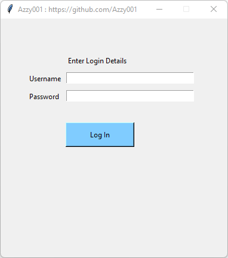

# Awesome_Login_System_Tk
A login system programmed using Tkinter library.

-----

# Important!
username and password == Admin

-----

# Features
If the user logins successfully, the system will display a messagebox and the message will say "Login successful". Also, the Login button will change colour to green.

If the user fails to login successfully, the system will show how many attempts remaining, once all attempts have been used, a messagebox will appear saying "System locked, please restart program". 

Moreover, the remaining attempts will change colour to red and the submit button will change to red. Also, the entries will be locked so you won't be able to enter/edit values.

-----

# Installation Guide

Firstly you will need to install pip, follow this link for a guide on how to install this 🏅 package manager: https://github.com/Azzy001/Vehicle_Management_System_Tk

You will need to install Tkinter library through Command Promt on your Windows OS.

Open CMD and type in the following command:

    pip install tk
    
Now you can run this program 🏆

-----

# Screenshots

